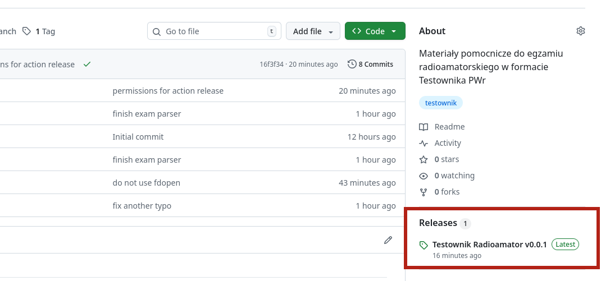

# Testownik Radioamator

Materiały pomocnicze do egzaminu radioamatorskiego w formacie Testownika popularnego wśród studentów Politechniki Wrocławskiej.

## Przeznaczenie

Repozytorium przeznaczone dla studentów PWr zainteresowanych zdobyciem uprawnień radioamatorskich.

## Wykorzystanie

Baza może zostać zaimportowana do jednej z wielu wersji aplikacji testownik dostępnych online. 
Przykładem może być [testownik Solvro](https://github.com/solvro/web-testownik) (Wymaga zalogowania do poprawnego zaimportowania quizu).

## Lokalizacja plików

Skompilowane archiwa ZIP umieszczone są w zakładce **Releases**.


## Kompilacja

W przypadku pojawienia się nowej wersji bazy możliwa jest jej samodzielna kompilacja po zmianie zawartości pliku *categories.yaml*.

Instalacja wymaganych bibliotek (Ubuntu):
```bash
sudo apt-get install -y build-essential pkg-config libcurl4-openssl-dev libglib2.0-dev libpoppler-glib-dev libstb-dev libarchive-dev yq
```

Kompilacja do katalogu *out*:
```bash
git clone https://github.com/cyanjnpr/testownik-radioamator/
cd testownik-radioamator/
make
bash release.sh
ls -l out/
```
